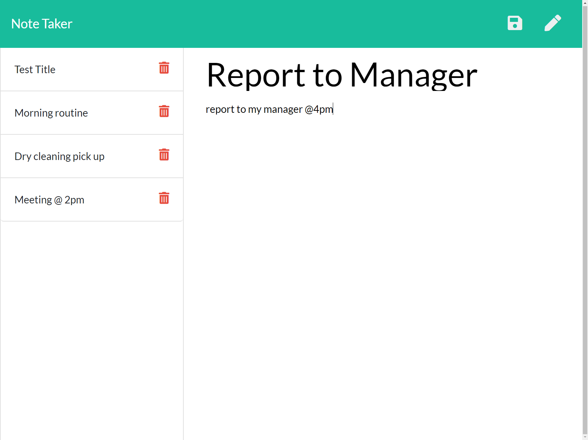
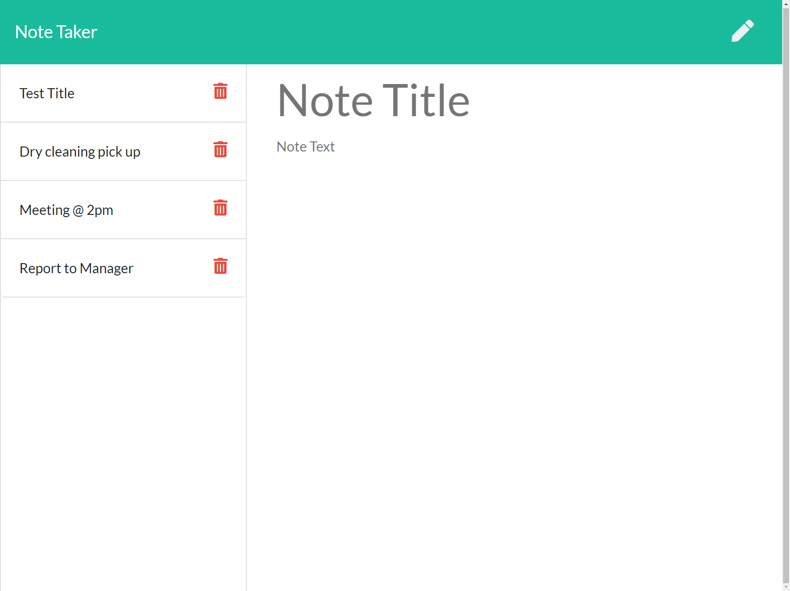

# NoteTaker
  https://github.com/KiloWattDot/NoteTaker
  
  ## Description
  This was built to make taking down notes much easier to do for users. This program allows you to create, keep, and remove your notes.

  ## Table of Contents
  * [ Description](#description)
  * [ Installation](#installation)
  * [ Usage](#usage)
  * [ License](#license)
  * [ Contributing](#contributing)
  * [ Tests](#tests)
  * [ Questions](#questions)

  ## Installation
  The following necessary dependencies that must be installed to run this application:
  * express, util, uuid

  ## Usage
   Notes Added
    
    Note Deleted [Morning Routine]
     
  
  ## License
  MIT

   
  
    https://opensource.org/licenses/MIT

  ## Contributing
   Controbutors: Dorothy Gilchrist

  ## Tests
  The following is needed to run the test: node sever
  
  ## Questions
  * If you have any questions about the repo, open an isse or contact: github.com/KiloWattDot
  * Email to reach us directly: Doro.Gilchrist@gmail.com

   

